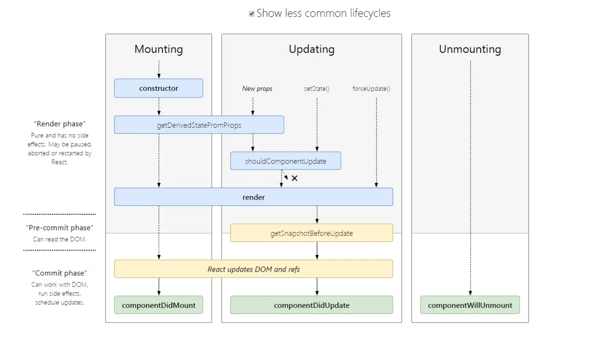

# React中的组件生命周期

> React 最新版本的生命周期，之前的版本已经废弃了一些生命周期方法，这里只介绍最新版本的生命周期方法。

在React中，组件的生命周期可以分为三个主要阶段：挂载（Mounting）、更新（Updating）和卸载（Unmounting）。React提供了一组特殊的方法，称为“生命周期方法”，这些方法会在组件不同生命周期阶段被自动调用。这里，我将以类组件为例来描述各个生命周期阶段及其对应的方法。

## 生命周期图示


## 挂载阶段（Mounting）

在挂载阶段，组件实例被创建并插入到DOM中。以下是这个阶段的生命周期方法：

1. **constructor**: 构造函数，用于初始化组件的`state`和绑定事件处理函数。在构造函数里面我们一般会做两件事：
- 初始化state对象
- 给自定义方法绑定this

2. **static getDerivedStateFromProps**: 在组件被挂载之前以及每次更新之前调用，用于从props中派生出新的state。
> 一个静态方法，所以不能在这个函数里面使用this，这个函数有两个参数props和state，分别指接收到的新参数和当前的state对象，这个函数会返回一个对象用来更新当前的state对象，如果不需要更新可以返回null。该函数会在挂载时，接收到新的props，调用了setState和forceUpdate时被调用

3. **render**: 该方法负责返回组件的JSX结构。这是唯一必需的生命周期方法。React中最核心的方法，一个组件中必须要有这个方法。返回的类型有以下几种：
- 原生的DOM，如div
- React组件
- Fragment（片段）
- Portals（插槽）
- 字符串和数字，被渲染成text节点
- Boolean和null，不会渲染任何东西
render函数是纯函数，里面只做一件事，就是返回需要渲染的东西，不应该包含其它的业务逻辑。

4. **componentDidMount**: 在组件被成功挂载（即添加到DOM中）后立即调用。这是执行副作用操作的好地方，例如发起网络请求。

```jsx
class App extends React.Component {
  constructor(props) {
    super(props);
    this.state = { /* 初始化 state */ };
  }

  static getDerivedStateFromProps(props, state) {
    // 返回一个对象更新state，或者返回null不更新任何内容
  }

  componentDidMount() {
    // 组件已挂载，执行副作用操作
  }

  render() {
    return (
      <div>
        {/* JSX 结构 */}
      </div>
    );
  }
}
```

## 更新阶段（Updating）

在更新阶段，由于`props`或`state`的变化，组件需要进行重新渲染。以下是这个阶段的生命周期方法：

1. **static getDerivedStateFromProps**: （同上）
2. **shouldComponentUpdate**: 返回一个布尔值，决定组件是否应该更新。默认情况下，它总是返回`true`。
3. **render**: （同上）
4. **getSnapshotBeforeUpdate**: 在最新的变更被提交到DOM之前被调用，用于捕获DOM信息（如滚动位置）。
5. **componentDidUpdate**: 在组件完成更新后立即调用。这也是执行副作用操作的好地方。

```jsx
class App extends React.Component {
  shouldComponentUpdate(nextProps, nextState) {
    // 决定是否应当更新
  }

  getSnapshotBeforeUpdate(prevProps, prevState) {
    // 捕获一些关于DOM的信息
  }

  componentDidUpdate(prevProps, prevState, snapshot) {
    // 组件已更新，执行副作用操作
  }

  render() {
    return (
      <div>
        {/* JSX 结构 */}
      </div>
    );
  }
}
```

## 卸载阶段（Unmounting）

在这个阶段，组件将从DOM中移除。

1. **componentWillUnmount**: 在组件被卸载和销毁之前立即调用。这是执行清理操作的好地方，例如取消定时器或网络请求。

```jsx
class App extends React.Component {
  componentWillUnmount() {
    // 组件将要卸载，执行清理操作
  }

  render() {
    return (
      <div>
        {/* JSX 结构 */}
      </div>
    );
  }
}
```

注意：以上只涵盖了React类组件的生命周期方法。React函数组件通过使用`useEffect` Hook也能实现类似的生命周期行为。

## `useEffect` Hook实现生命周期行为

`useEffect` Hook可以让你在函数组件中执行副作用操作。它与类组件中的生命周期方法类似，但有一些不同之处。

1. **componentDidMount**：在组件被挂载之后立即调用。如果你需要在组件挂载后执行某些操作（例如，发起网络请求），则可以在`useEffect`中执行这些操作。如果你需要在组件挂载和卸载之后执行某些操作（例如，添加和移除事件监听器），则可以传递一个空数组（`[]`）作为第二个参数。这样，你就可以避免在每次更新时都重新执行副作用操作。

    ```jsx
    useEffect(() => {
      // 执行副作用操作
      return () => {
        // 在组件卸载时执行清理操作
      };
    }, []); // 传递一个空数组作为第二个参数
    ```
2. **componentDidUpdate**：在组件更新后立即调用。如果你需要在组件更新后执行某些操作（例如，获取DOM节点的最新快照），则可以在`useEffect`中执行这些操作。如果你需要在组件更新后执行某些操作，但又不想在组件挂载时执行这些操作，则可以传递一个数组（`[value]`）作为第二个参数。这样，只有当`value`发生变化时，才会执行副作用操作。

    ```jsx
    useEffect(() => {
      // 执行副作用操作
      return () => {
        // 在组件卸载时执行清理操作
      };
    }, [value]); // 传递一个数组作为第二个参数
    ```

3. **componentWillUnmount**：在组件卸载和销毁之前立即调用。如果你需要在组件卸载和销毁之前执行某些操作（例如，清除定时器），则可以在`useEffect`中执行这些操作。

    ```jsx
    useEffect(() => {
      // 执行副作用操作
      return () => {
        // 在组件卸载时执行清理操作
      };
    });
    ```

## 父子组件生命周期

在 React 应用中，组件的嵌套是非常常见的，经常会有父组件包含子组件的情况。在这种嵌套关系中，父子组件的生命周期函数是如何依次执行的呢？了解这一点对于掌握 React 内部机制是非常有帮助的。

下面是一个简单的父子组件的生命周期执行顺序的例子：

### 类组件示例

#### 挂载阶段（Mounting）

1. 父组件 constructor
2. 父组件 `static getDerivedStateFromProps`
3. 父组件 `render`
4. 子组件 constructor
5. 子组件 `static getDerivedStateFromProps`
6. 子组件 `render`
7. 子组件 `componentDidMount`
8. 父组件 `componentDidMount`

#### 更新阶段（Updating）

1. 父组件 `static getDerivedStateFromProps`
2. 父组件 `shouldComponentUpdate`
3. 父组件 `render`
4. 子组件 `static getDerivedStateFromProps`
5. 子组件 `shouldComponentUpdate`
6. 子组件 `render`
7. 子组件 `getSnapshotBeforeUpdate`
8. 父组件 `getSnapshotBeforeUpdate`
9. 子组件 `componentDidUpdate`
10. 父组件 `componentDidUpdate`

#### 卸载阶段（Unmounting）

1. 父组件 `componentWillUnmount`
2. 子组件 `componentWillUnmount`

#### 函数组件示例（使用 Hooks）

对于使用 Hooks 的函数组件，你通常会用 `useEffect` 来处理副作用，包括挂载和卸载：

- `useEffect(() => { /* 副作用代码 */ }, [])`: 类似于 `componentDidMount`。
- `useEffect(() => { /* 副作用代码 */ })`: 类似于 `componentDidUpdate`。
- `useEffect(() => { /* 副作用代码 */ return () => { /* 清理代码 */ }; }, [])`: 清理代码类似于 `componentWillUnmount`。

在父子组件中，`useEffect` 的执行顺序类似于 `componentDidMount` 和 `componentDidUpdate`：先子后父。

注意：这是一个简化的示例，实际应用中可能会更复杂。但它给出了一个大致的顺序，帮助你理解父子组件是如何交互的。

## 参考资料
[我对 React v16.4 生命周期的理解](https://juejin.cn/post/6844903655372488712)